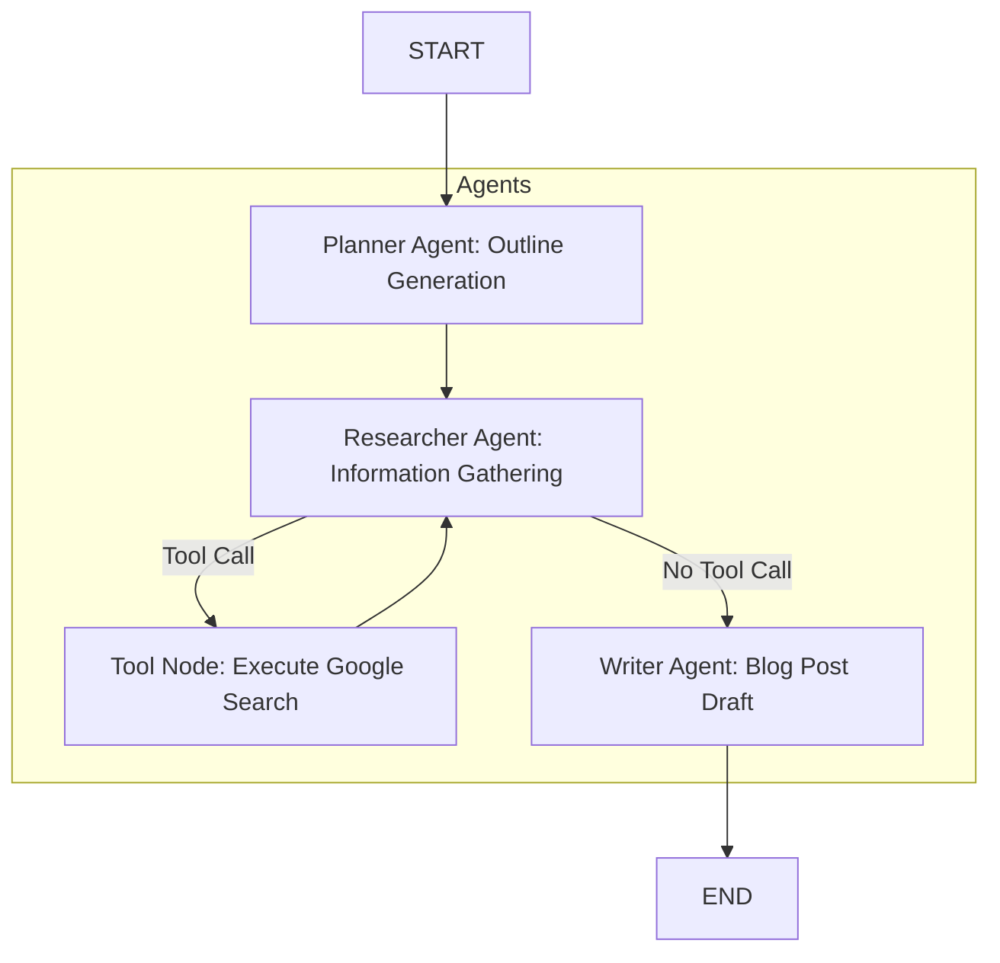

# 📝 Multi-Agent Blog Writer

This project demonstrates a sophisticated multi-agent system built using **LangChain** and **LangGraph** to automate the process of generating blog posts. Given a topic, the system plans the content, researches relevant information, and then writes a comprehensive blog post.

---

## 🧠 Architecture

The core of this project is a **LangGraph** workflow that orchestrates the interaction between different AI agents. Each agent has a specific role and passes its output to the next stage in the process.

### Agent Roles

- **Planner**:  
  Takes the initial blog post topic and generates a detailed outline, including sections, sub-sections, and research tasks.

- **Researcher**:  
  Receives the plan from the Planner. It then decides whether to use the `google_search` tool to gather information based on the research tasks.  
  - If research is needed, it calls the **Tool Node**.  
  - If no research is needed (or after research is complete), it passes the accumulated research to the Writer.

- **Tool Node**:  
  This is a special node that executes any tool calls made by the Researcher (e.g., performing a Google Search). After execution, it returns the results back to the Researcher.

- **Writer**:  
  Receives the detailed plan and any gathered research results. It then synthesizes this information into a complete blog post draft.

---

### 📊 Workflow Diagram



---

## 🚀 Setup

Follow these steps to get the project up and running on your local machine.

### ✅ Prerequisites

- Python 3.9+
- A Google Cloud Project with the **Custom Search API** enabled
- A Google **API Key** for accessing Google services
- A **Google Custom Search Engine ID (CSE ID)** configured to search the entire web

---

### 1. Create a Virtual Environment

It's highly recommended to use a virtual environment to manage project dependencies.

```bash
python3 -m venv langchain_agent_env
source langchain_agent_env/bin/activate
```

---

### 2. Install Dependencies

Navigate to the project root and install the required Python packages:

```bash
pip install -r requirements.txt
```

---

### 3. Configure API Keys & Environment Variables

Create a `.env` file in the root of your project (`multi-agent-blog-writer/`) and add your Google API Key and Custom Search Engine ID.

#### `.env` example:

```env
GOOGLE_API_KEY="your_google_api_key_here"
GOOGLE_CSE_ID="your_google_cse_id_here"
```

#### 🔑 How to get `GOOGLE_API_KEY`:

1. Go to the [Google Cloud Console](https://console.cloud.google.com/).
2. Create a new project or select an existing one.
3. Navigate to **APIs & Services** > **Credentials**.
4. Click **Create Credentials** > **API key**. Copy the generated key.

#### 🔍 How to get `GOOGLE_CSE_ID`:

1. Go to the [Google Programmable Search Engine](https://programmablesearchengine.google.com/).
2. Click **Add** to create a new search engine.
3. In the "What to search?" section, select **Search the entire web**.
4. Give your search engine a name and click **Create**.
5. On the "Overview" tab, copy your **Search engine ID**.

---

## 🏃 How to Run

Once you have set up the environment and configured your API keys, you can run the multi-agent system:

1. Activate your virtual environment (if not already active):

```bash
source langchain_agent_env/bin/activate
```

2. Navigate to the project root directory (where `app/` and `main.py` are located):

```bash
cd multi-agent-blog-writer/
```

3. Run the main application script:

```bash
python -m app.main
```

The script will execute the workflow, printing the intermediate states of the agents and finally the generated blog post draft to your console.

---

## 📄 License

This project is open-source and available under the **MIT License**.